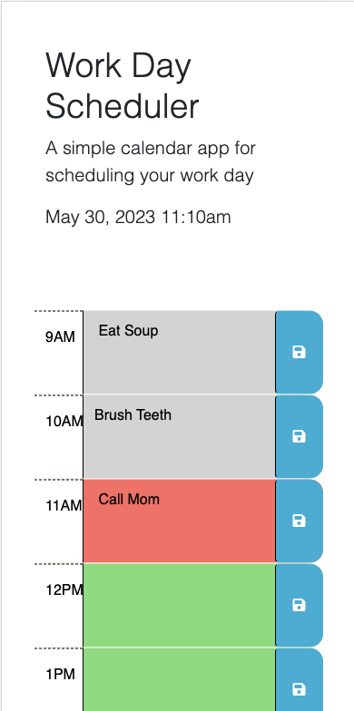

# Workday Scheduler
Create a calendar application that allows the user to save events at each hour of the day and color code time sensitive information. 

## Description
This web application was designed such that a user can write hourly to-do lists and save to local storage. When the user re-open the page, their list will populate until they clear their local storage or override their save. The hour sections are color coded to indicate the past, present or future and adjusts color automatically. 

## Screenshot of Application
Below is a picture of the deployed application. 

## Link to Deployed Application 

## Installation
This code can be downloaded via Zip files and imported to an IDE.

## Notes
The University of Oregon Full Stack Coding Bootcamp supplied this starter code framework from GitHub Collaborations The Coding Bootcamp (coding-boot-camp/crispy-octo-meme). 